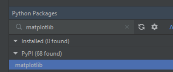
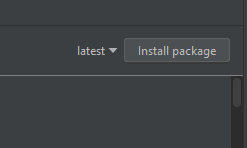

# PythonTP1
Travail Pratique 1 du cours de programmation orientée objet Hiver 2023

## Introduction

## Prérequis
1) cloner le dépôt
2) installer lìnterpreter (venvironnement)
3) installer le package matplotlib
   1) PyCharm: View -> Tool Windows -> Python Packages
   2) Rechercher matplotlib (pas de 'h' à mat)
   
   3) cliquer "install package"
   

## Exercices

### Implémenter des polygones (10 points)
La classe abstraite Polygone vous est fournie dans le fichier polygone.py
 - la classe déclare une liste de vecteurs (_liste_vecteur) qui contient des Vecteur
 - les vecteurs sont définis par la classe Vecteur
 - les vecteurs ont un point de départ (_point_depart) et d'arrivée (_point_arrivee)
 - la classe Point défini un point _x,_y
1) Implémenter la méthode perimetre(self) de la classe Polygone
   1) la méthode doit retourner le périmètre du polygone
   2) vous aurez besoin de la méthode longueur(self) de la classe Vecteur (voir plus bas)
2) Implémenter la méthode nb_cotes(self) de la classe Polygone
   1) la méthode doit retourner le nombre de côtés du polygone
3) Implémenter la méthode longueur(self) de la classe Vecteur
   1) Doit retourner la longueur du Vecteur
4) Implémenter la classe Triangle dérivant de Polygone
   1) Cette classe doit implémenter la méthode abstraite de Polygone
5) Implémenter la classe HexagoneRegulier dérivant de Polygone
   1) Pour fin de tests, seulement les hexagones réguliers seront définis
   2) Cette classe doit implémenter la méthode abstraite de Polygone
6) Ajouter la validation de valeur pour les Points
   1) Si la valeur est supérieure à 10, une Exception "ValueError" doit être lancée
   2) Si la valeur est inférieure à -10, une Exception "ValueError" doit être lancée

Notes:
- Vous pouvez toujours afficher la forme avec la méthode "afficher_forme(self)" pour voir le résultat de la forme
- Vous pouvez utiliser les bibliothèques standard de Python qui ne nécessitent aucune installation
- Astuce: le module "math" peut vous être utile
- Vous pouvez aussi utiliser les modules provenant du package "matplotlib"
- Vous devez créer vous-même les vecteurs pour les formes pour tester

### Utilisation des structures de données (10 points)
Le fichier arbrebinaire.py contient les classes suivantes:
- Noeud: Permet d'implémenter un arbre binaire de recherche
- EquipeLNH: Permet d'instancier une équipe de hockey de la LNH
  + La variable __nom contient le nom de l'équipe
  + La variable data contient un dictionnaire contenant les statistiques de l'équipe
    + 'MJ': Nombre de match joués
    + 'V' : Nombre de victoires
    + 'DP' : Nombre de défaites en prolongations
    + 'BP' : Nombre total de but pour
- DataUtils: 
  - méthode load_data(filename): Permet de charger le data des équipes à partir d'un CSV
  - méthode moyenne_bas_haut(liste_equipes): à implémenter, voir ci-bas 

1) Implémenter la méthode total_points(self) dans la classe EquipeLNH
   + Une victoire donne 2 points
   + Une défaite en prolongation donne 1 point
   + Doit retourner le total de points
2) Implémenter la méthode moyenne_but_par_match(self) dans la classe EquipeLNH
   + Doit retourner la moyenne de point par match
3) Implémenter la méthode insertion(self, equipe) dans la classe Noeud
   1) Si le nombre de points est plus petit que le noeud courant, l'équipe doit être insérée dans l'enfant de gauche
   2) Sinon, il doit être inséré à droite
   3) Si tout est correct, la méthode afficher_arbre(self) devrait afficher les équipes dans l'ordre des points
      + On ignore les règles de départage pour le même nombre de points, l'ordre d'insertion prime
4) Implémenter la méthode statique moyenne_bas_haut(liste_equipes) de la classe DataUtils
   + Prend en entrée la liste d'équipe
   + Doit retourner 2 tuples, bas et haut
   + bas contient les équipes (objets EquipeLHN) dont la moyenne de buts par match est plus petite que la moyenne de tout les équipes
   + haut contient les équipes (objets EquipeLNH) dont la moyenne de buts par match est égale ou supérieurs à la moyenne de tout les équipes

## Critères d'évaluation

   - Respect de l'encapsulation
   - Fonctionnalité du code, résultat des tests
   - Respect des conventions Python
   - Présence de commentaires explicatifs du code

## Bugs
Me contacter par MIO si vous trouvez des bugs